# SagittaDB Enterprise 产品使用手册

本文面向 SagittaDB Enterprise 的客户管理员、DBA、研发负责人、审批人、审计人员和普通查询用户，帮助团队理解主要功能、常用路径和上线后的日常使用方式。

截图来自 SagittaDB 测试环境，仅截取产品页面内容，不包含测试环境服务器 IP、浏览器地址栏或客户数据。实际页面会因客户版本、License、角色权限、实例数量和系统配置略有差异。

## 1. 角色与常用入口

| 角色 | 常用入口 | 主要任务 |
|---|---|---|
| 平台管理员 | 系统管理、资源组、审批流程、商业交付 | 初始化组织、配置用户角色、接入 License、生成验收材料。 |
| DBA | 实例管理、SQL 工单、观测中心、数据归档 | 接入数据库、审批和执行变更、诊断实例、处理归档。 |
| 研发用户 | SQL 工单、在线查询、查询权限、数据字典 | 提交变更、查询数据、申请权限、查看库表结构。 |
| 审批人 | SQL 工单、查询权限、审批记录 | 审核 SQL 变更、查询授权和归档申请。 |
| 审计人员 | 审计日志、查询历史、商业交付 | 追踪登录、查询、授权、工单和系统配置变更。 |

建议首次试用时先使用平台管理员账号完成初始化，再分别用 DBA、研发用户和审批人账号演示完整流程。

## 2. 登录与首页

入口：登录页、侧边栏 `Dashboard`。

1. 打开客户侧 SagittaDB 访问地址。
2. 使用账号密码或已启用的企业身份入口登录。
3. 如系统提示默认密码、弱密码或密码过期，请先完成改密。
4. 登录成功后进入 Dashboard。

Dashboard 会按当前用户权限范围展示在线查询、SQL 工单、数据归档、实例与数据库等概览。研发用户通常关注自己的查询和工单状态，DBA 关注待审批、待执行和实例运行状态，管理员关注初始化完整性和授权状态。

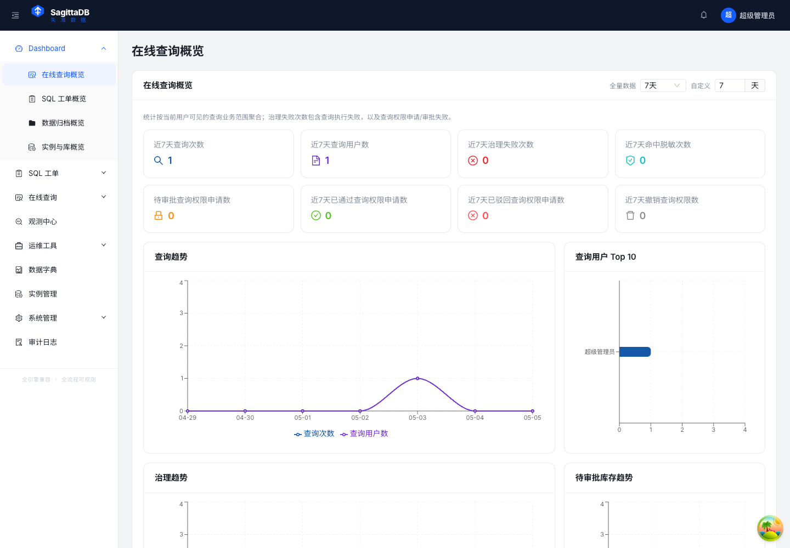

如果看不到某些菜单或数据，优先检查角色权限、用户组、资源组和查询授权。

## 3. 首次初始化推荐顺序

管理员建议按以下顺序完成初始化：

1. 打开 `商业交付` -> `License 授权`，确认试用或正式授权状态。
2. 打开 `系统管理` -> `用户管理`，创建用户或配置企业身份登录。
3. 打开 `系统管理` -> `角色管理`，确认管理员、DBA、研发、审批人和审计员权限。
4. 打开 `系统管理` -> `资源组`，按业务线、环境或项目创建资源组。
5. 打开 `实例管理`，接入数据库实例并注册数据库或 Schema。
6. 打开 `系统管理` -> `审批流程`，配置 SQL 工单和查询权限审批链路。
7. 打开 `商业交付` -> `交付与支持`，生成一次验收报告。

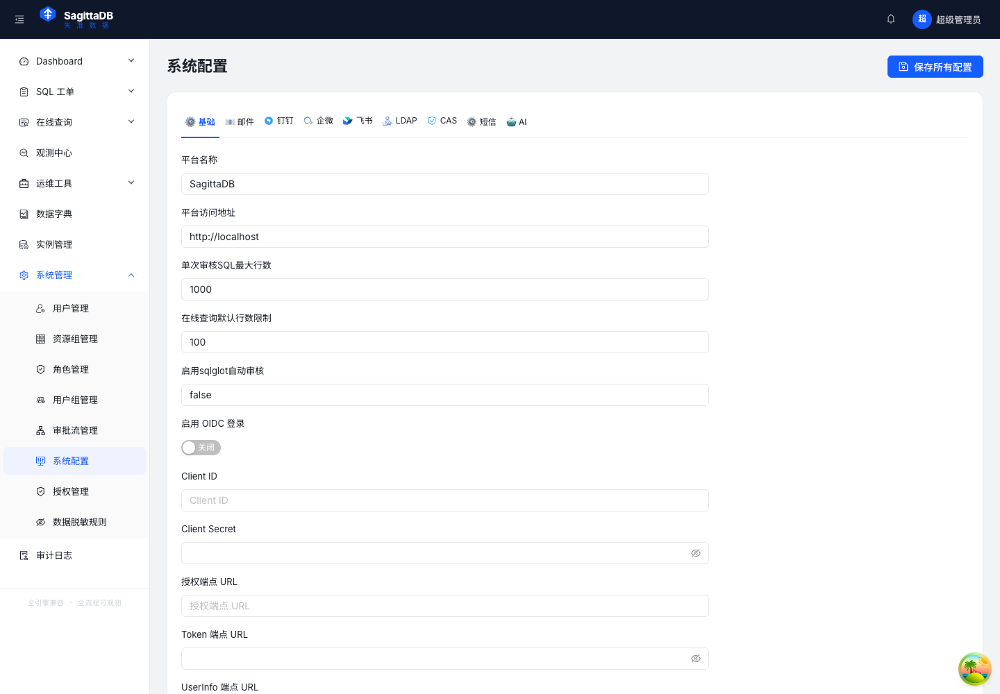

## 4. 实例管理

入口：侧边栏 `实例管理`。
适用角色：平台管理员、DBA、实施顾问。

实例管理用于维护 MySQL、TiDB、PostgreSQL、Oracle、SQL Server、MongoDB、Redis、ClickHouse、StarRocks 等数据库实例。管理员可以新建实例、测试连接、设置资源组、查看库表结构和维护实例状态。

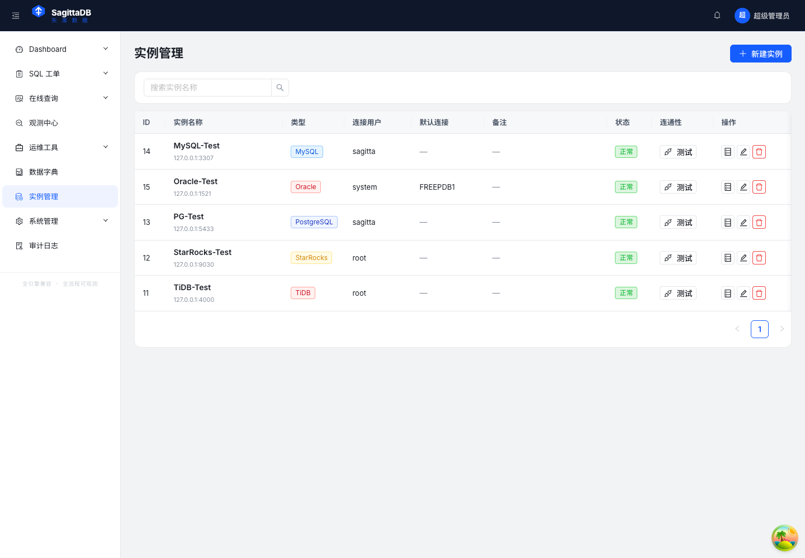

### 新建实例

1. 点击 `新建实例`。
2. 填写实例名称、数据库类型、主机、端口、用户名和密码。
3. 如需通过跳板机访问，填写 SSH 隧道配置。
4. 点击 `测试连接`。
5. 测试通过后保存。
6. 将实例加入合适资源组。

生产环境建议为 SagittaDB 配置只读诊断账号和受控变更账号，避免直接使用数据库超级管理员账号。

### 注册数据库或 Schema

数据库或 Schema 注册完成后，SQL 工单、在线查询、数据字典和权限申请才有明确目标。管理员可以从实例同步数据库列表，也可以手动维护启停状态。

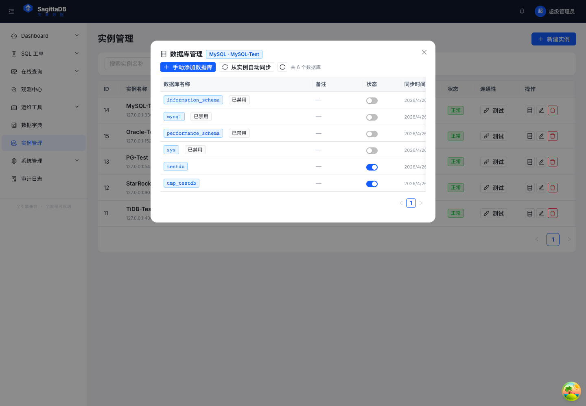

## 5. SQL 工单

入口：侧边栏 `SQL 工单`。
适用角色：研发用户、DBA、审批人。

SQL 工单用于规范数据库变更流程。典型链路是：研发提交 SQL -> 系统检查风险 -> 审批人审核 -> DBA 或自动策略执行 -> 审计日志留痕。

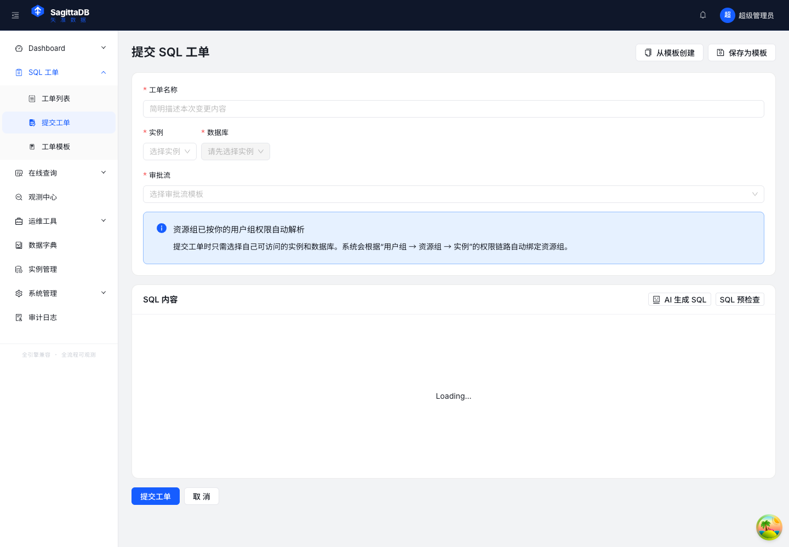

### 提交工单

1. 进入 `SQL 工单`，点击提交工单。
2. 填写标题、目标实例、数据库和变更说明。
3. 输入 SQL 内容。
4. 查看语法、风险和规则检查结果。
5. 补充回滚方案或业务窗口说明。
6. 提交工单。

高风险 SQL 应先在测试环境验证，并在工单中写清影响范围、执行窗口和回滚方案。

### 查看和审批

工单列表通常包含 `我的工单`、`审批记录` 和 `执行记录`。审批人打开详情后，可以查看提交人、目标实例、数据库、SQL 内容、风险提示和审批链路。

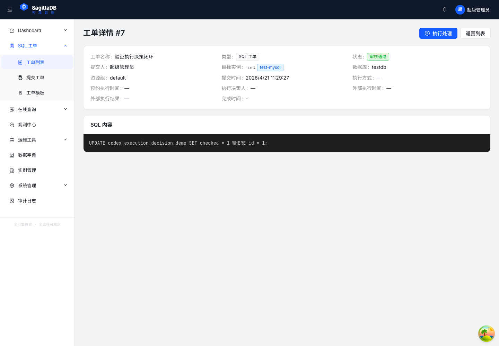

审批时请重点关注：

- 目标实例和数据库是否正确。
- SQL 是否符合变更窗口和业务预期。
- 是否有备份、回滚方案和风险说明。
- 是否需要 DBA 人工执行。

## 6. 在线查询

入口：侧边栏 `在线查询`。
适用角色：研发用户、DBA。

在线查询用于受控的数据查询。用户只能访问被授权的实例和数据库，查询结果会按权限控制展示和导出，敏感字段会按脱敏规则处理，查询历史会进入审计。

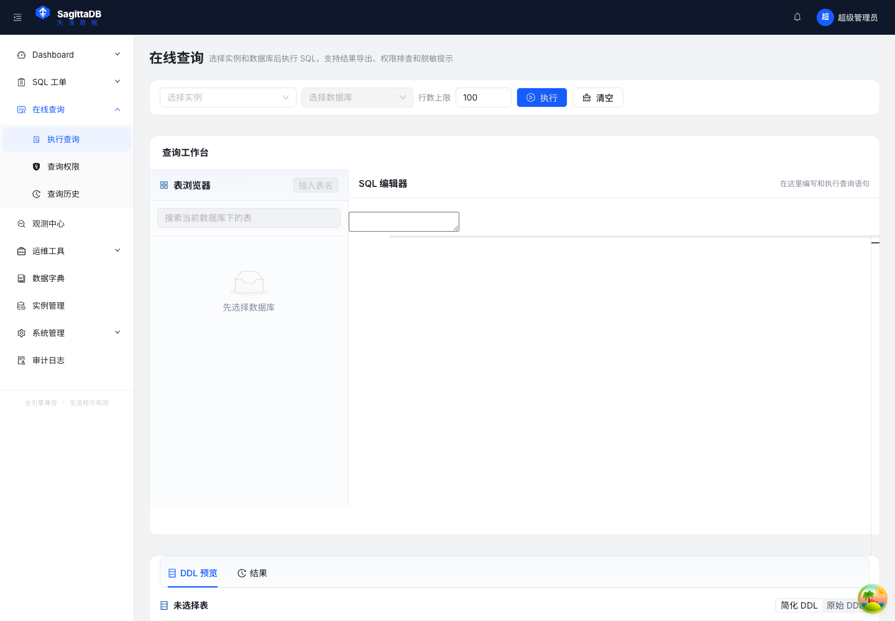

使用步骤：

1. 选择实例。
2. 选择数据库或 Schema。
3. 在左侧浏览表结构。
4. 在编辑器中输入只读 SQL。
5. 点击执行。
6. 查看结果、错误提示或脱敏展示。

如果页面提示无权限，请先通过 `查询权限` 提交申请。

## 7. 查询权限

入口：侧边栏 `在线查询` -> `查询权限`。
适用角色：研发用户、审批人、DBA。

查询权限用于临时或长期授权。用户提交资源组、实例、数据库、表范围和有效期后，审批人按流程确认用途和范围。到期后权限会自动失效或需要重新申请。

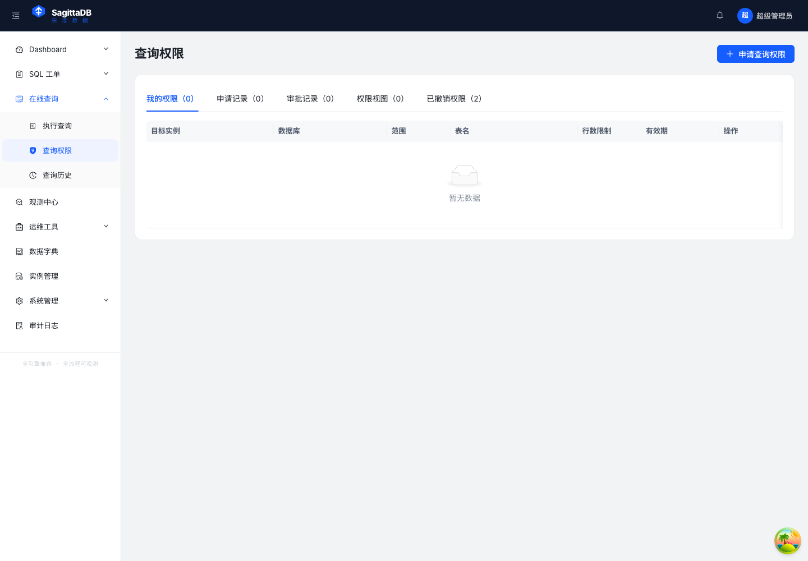

审批时建议关注：

- 申请理由是否明确。
- 访问范围是否过大。
- 有效期是否符合最小必要原则。
- 是否涉及生产敏感数据。

## 8. 数据字典

入口：侧边栏 `数据字典`。
适用角色：研发用户、DBA、数据人员。

数据字典用于查看库、表、字段、索引和备注信息，减少直接登录数据库查看结构的需求。团队可以在平台内统一理解业务数据结构。

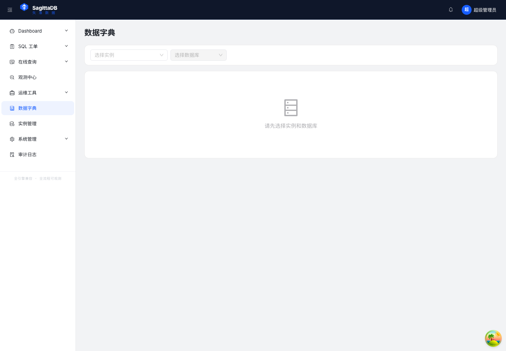

建议管理员定期补齐关键表和字段说明，让研发、测试和数据人员能自助查询。

## 9. 数据脱敏

入口：侧边栏 `运维工具` 或对应治理菜单中的 `数据脱敏`。
适用角色：平台管理员、安全管理员、DBA。

数据脱敏用于保护手机号、邮箱、身份证号、地址、Token、密钥等敏感字段。管理员可以配置规则，并应用到查询结果和导出流程。

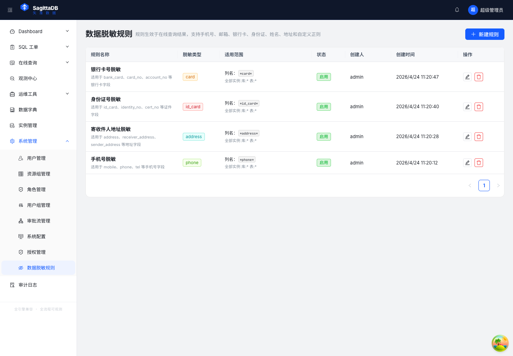

上线前建议检查：

- 客户个人信息字段。
- 员工个人信息字段。
- 业务密钥、Token 和凭证字段。
- 审计和导出场景中的敏感数据展示。

## 10. 监控与诊断

入口：侧边栏 `观测中心`。
适用角色：DBA、运维人员。

监控与诊断用于查看实例状态、慢 SQL、会话、容量和采集异常。不同数据库的高级诊断能力取决于现场账号权限、数据库版本和驱动支持。

如果页面显示权限不足或采集失败，请先确认数据库账号是否具备对应只读视图权限，再检查网络连通性和采集任务日志。

## 11. 数据归档

入口：侧边栏 `运维工具` -> `数据归档`。
适用角色：DBA、运维人员、审批人。

数据归档用于将历史数据按策略迁移、下沉或归档。归档前必须确认归档条件、备份状态、测试环境验证结果和业务团队确认。

执行后请查看任务状态、归档结果和审计记录。生产归档应安排在业务低峰期，并提前准备回滚方案。

## 12. 用户、角色与资源组

入口：侧边栏 `系统管理`。
适用角色：平台管理员。

管理员通过用户、角色、资源组和审批流程决定“谁能看到什么、谁能操作什么、谁来审批什么”。

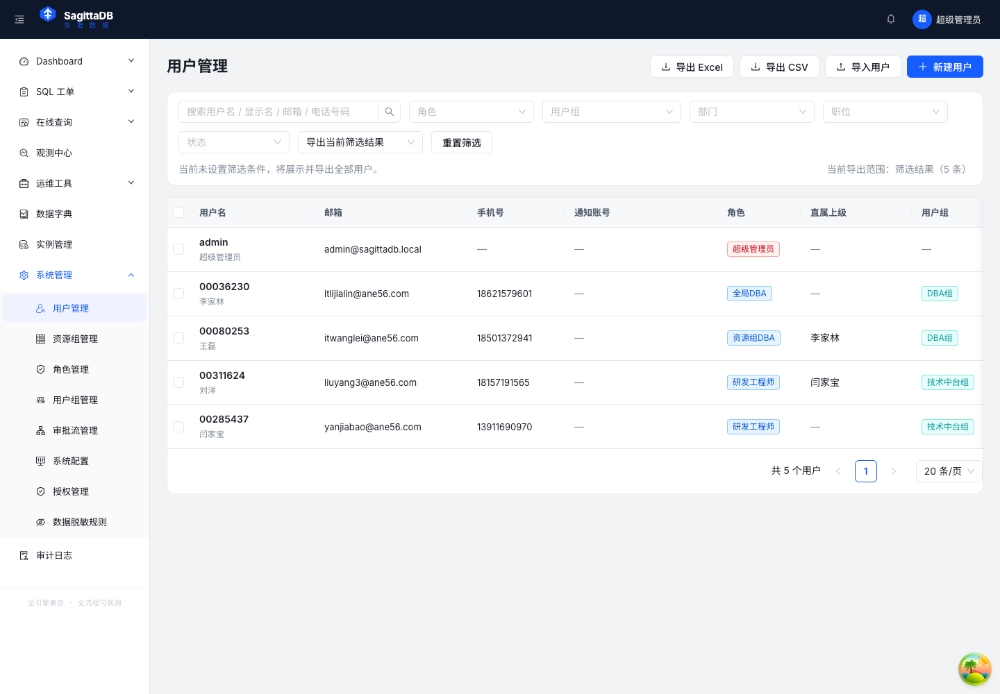

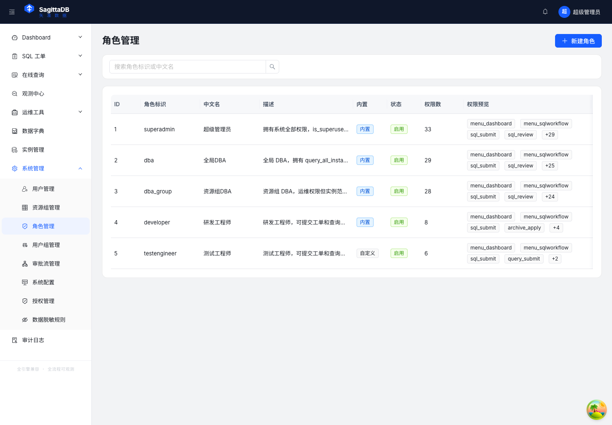

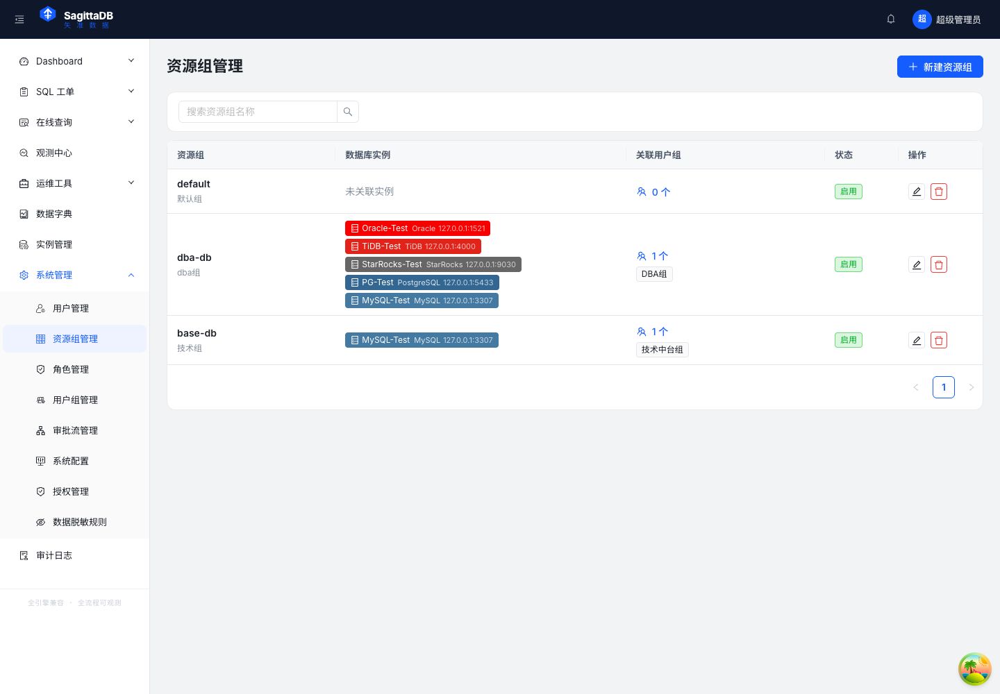

建议原则：

- 角色控制功能操作。
- 用户组组织人员。
- 资源组组织数据库实例。
- 查询权限控制具体数据访问范围。
- 审批流程控制高风险操作。

## 13. 审批流程

入口：侧边栏 `系统管理` -> `审批流程`。
适用角色：平台管理员、审批负责人。

审批流程用于配置 SQL 工单、查询权限和其他治理动作的审核链路。流程应尽量贴近客户组织结构，例如研发负责人初审、DBA 复核、安全或业务负责人终审。

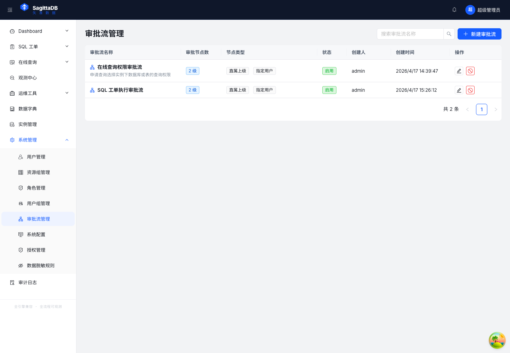

变更审批流程前，请确认是否会影响正在流转的工单。已创建工单通常使用创建时的审批快照。

## 14. 审计日志

入口：侧边栏 `审计日志`。
适用角色：审计人员、平台管理员。

审计日志记录用户登录、SQL 工单、在线查询、导出、授权和系统配置变更等行为。审计人员可以按用户、资源、时间和操作类型筛选。

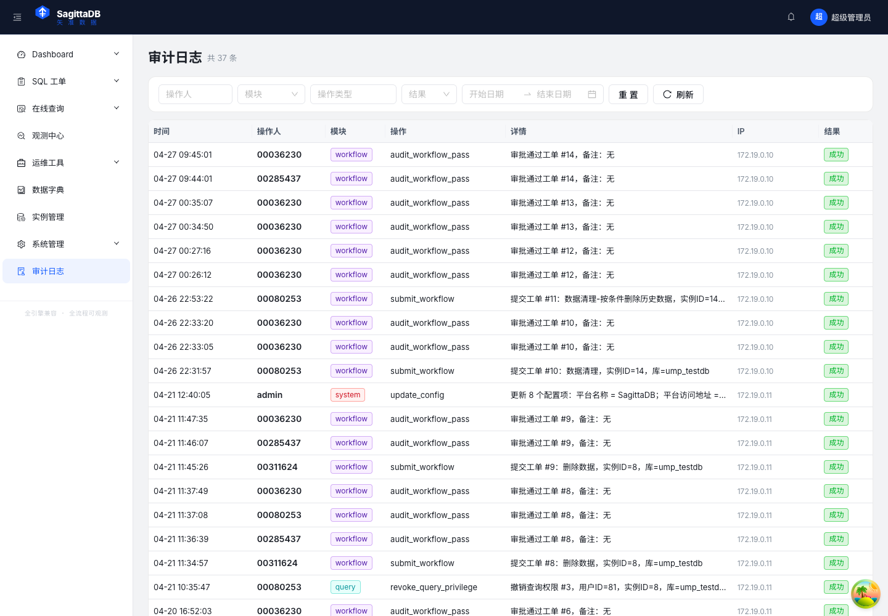

建议定期导出并归档审计记录，满足客户内部安全和合规要求。

## 15. License 授权与商业交付

入口：侧边栏 `商业交付` -> `License 授权`、`交付与支持`。
适用角色：平台管理员、实施顾问、运维人员。

授权页面用于查看试用期、正式授权、客户 ID、部署指纹、在线激活和离线 challenge-response 流程。

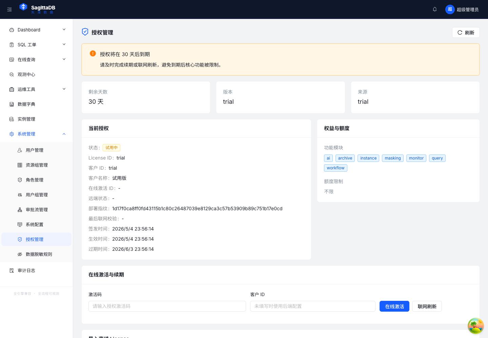

`交付与支持` 通常用于：

- 查看推广就绪度。
- 检查试用和授权状态。
- 确认客户 ID 和部署指纹。
- 生成验收报告。
- 导出脱敏诊断包。
- 查看支持矩阵和告警事件。

正式推广前，建议完成交付向导并生成验收报告。

## 16. 常见问题

| 问题 | 处理建议 |
|---|---|
| 看不到菜单 | 检查角色权限、License 功能范围和用户状态。 |
| 看不到实例或数据库 | 检查资源组、用户组、实例状态和数据库启用状态。 |
| 在线查询被拒绝 | 检查功能权限、查询授权、SQL 类型和实例状态。 |
| 工单无法提交 | 检查目标实例、数据库、审批流程和 SQL 风险规则。 |
| 监控数据为空 | 检查数据库账号权限、采集任务和实例连通性。 |
| License 激活失败 | 检查客户 ID、部署指纹、授权中心连通性和服务器时间。 |

共享截图或诊断包前，请先确认没有暴露服务器 IP、客户数据、数据库密码、License 文件、激活码或 `.env` 敏感值。
