# Sagitta Control 产品使用手册

本文面向平台管理员、DBA、研发用户、审批人、运维人员和审计人员，说明 Sagitta Control 部署完成后如何完成初始化配置、如何让业务团队正式使用，以及各功能模块的日常操作方式。

## 1. 部署后的上线配置路径

Sagitta Control 部署完成并通过前后端健康检查后，建议管理员按以下顺序完成初始化。这个顺序可以避免“用户能登录但看不到实例”“工单提交后没人审批”“查询可用但没有脱敏和审计边界”等常见问题。

### 1.1 登录并确认平台状态

1. 使用客户侧访问地址打开 Sagitta Control。
2. 使用初始化管理员账号登录。
3. 进入 `商业交付` -> `License 授权`，确认试用或正式授权状态可用。
4. 进入 `商业交付` -> `交付与支持`，查看推广就绪度和客户环境用量。
5. 进入 `系统管理` -> `系统配置`，确认平台名称、访问地址、审计保留天数、查询限制和诊断采样保留天数。

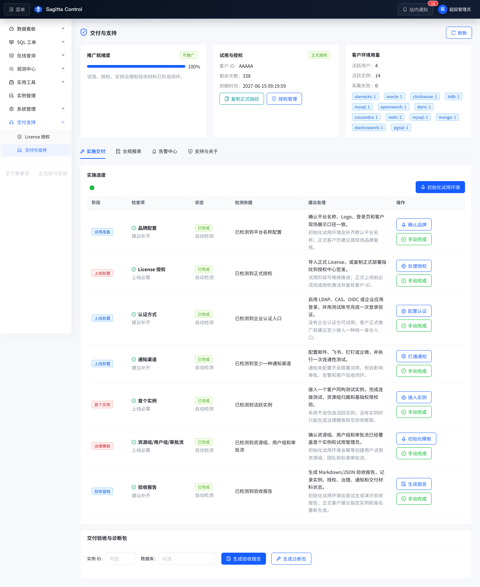

### 1.2 配置认证、通知和基础参数

入口：`系统管理` -> `系统配置`。

建议先完成以下配置：

- 基础：平台名称、平台访问地址、SQL 最大行数、在线查询默认行数限制、审计与查询历史保留天数。
- 认证：根据客户环境启用账号密码、LDAP、CAS、OIDC、短信、钉钉、飞书或企业微信入口。
- 通知：配置邮件、钉钉、企业微信、飞书等通知渠道，用于审批、工单执行和告警提醒。
- AI：如需要 SQL 生成或 SQL 辅助能力，再配置对应模型服务和调用参数。

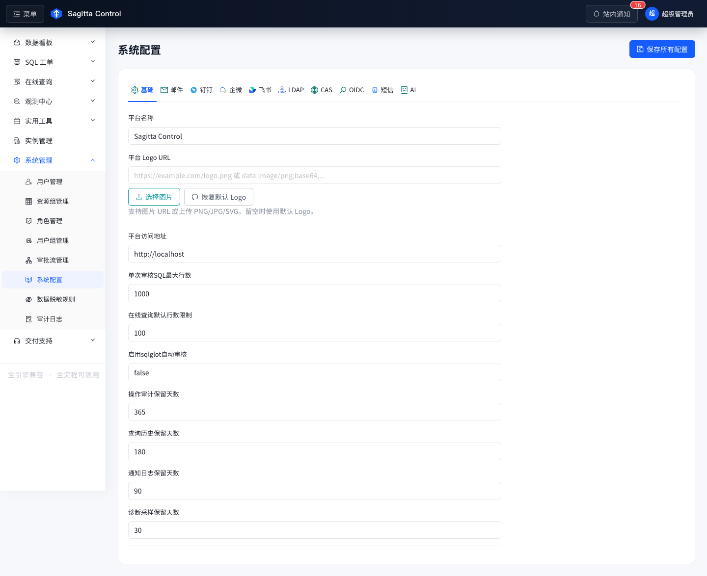

### 1.3 建立组织和权限模型

建议先建角色，再建资源组和用户组，最后把用户放入用户组并绑定角色。

1. 进入 `系统管理` -> `角色管理`，按职责创建平台管理员、DBA、研发工程师、审批人、审计人员等角色。
2. 进入 `系统管理` -> `资源组管理`，按业务线、环境、项目或系统边界创建资源组。
3. 进入 `系统管理` -> `用户组管理`，按团队或项目创建用户组，并关联可访问的资源组。
4. 进入 `系统管理` -> `用户管理`，创建或导入用户，绑定角色、直属上级、用户组和状态。

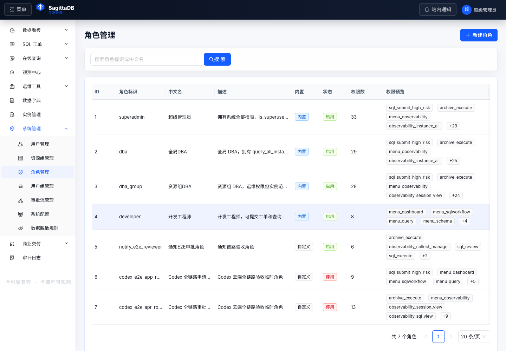

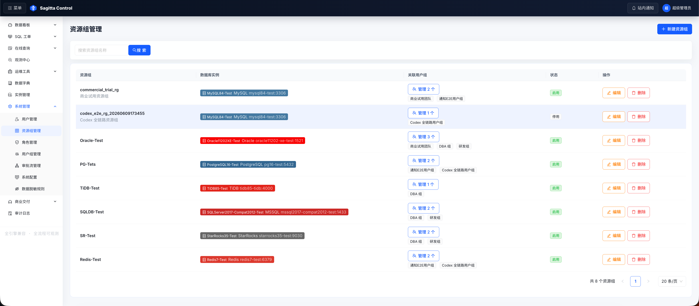

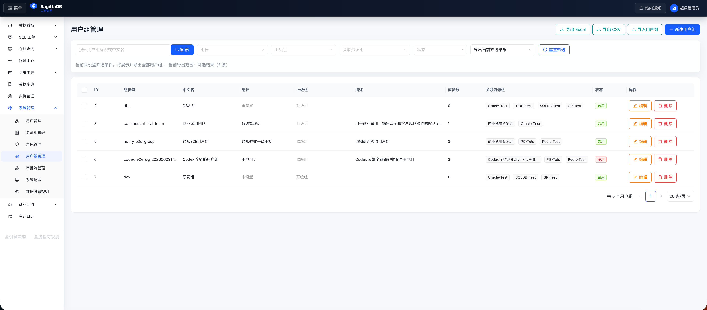

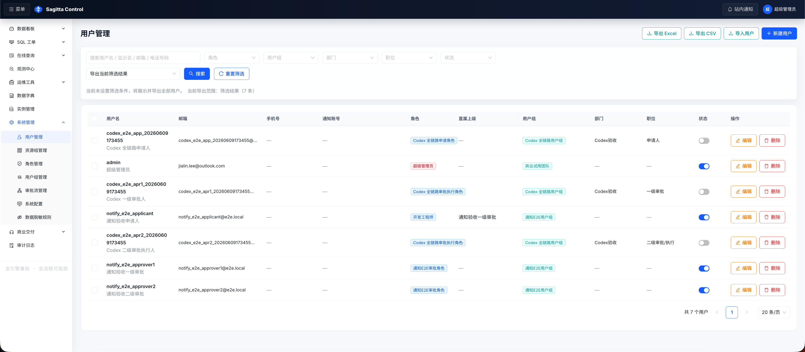

### 1.4 接入首批数据库实例

入口：`实例管理`。

新增实例时，需要维护实例名称、数据库类型、连接地址、端口、认证信息、默认库、备注和启用状态。实例保存后应立即执行连通性测试，并确认实例已经加入正确资源组。

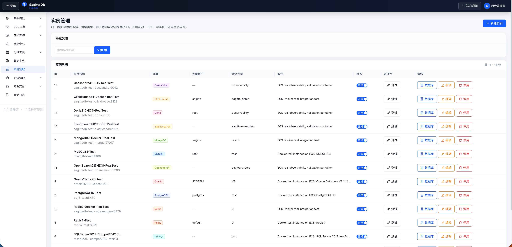

生产环境建议：

- 为查询和诊断使用只读或最小权限账号。
- 为 SQL 工单执行使用受控账号，并配合审批流限制高风险操作。
- 不要把数据库超级管理员账号作为普通业务变更账号长期使用。
- 实例接入后先在测试库或灰度实例上验证查询、工单、字典和观测能力。

### 1.5 配置审批流

入口：`系统管理` -> `审批流管理`。

审批流用于 SQL 工单、查询权限和数据归档。常见配置方式包括：

- 查询权限：直属上级或指定 DBA 审批。
- 普通 SQL 工单：研发负责人 -> DBA 审批并执行。
- 高风险 SQL 工单：研发负责人 -> DBA -> 安全或业务负责人。
- 数据归档：业务负责人 -> DBA -> 运维窗口确认。

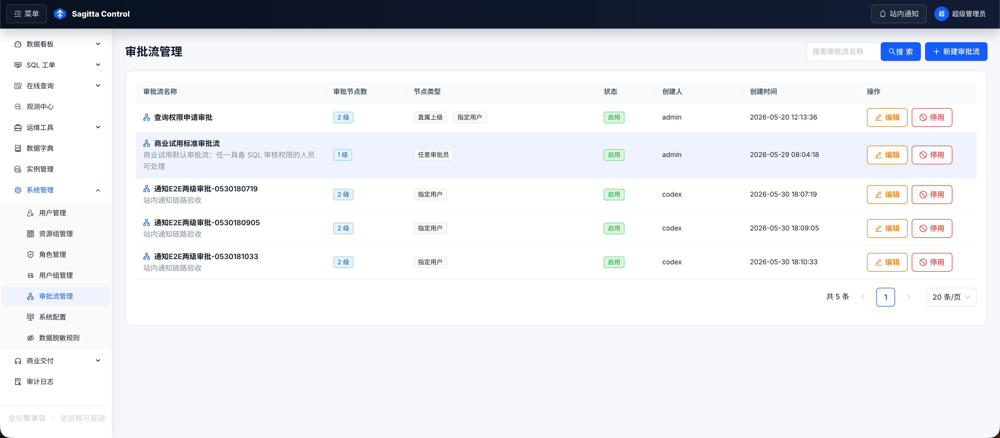

### 1.6 配置数据脱敏规则

入口：`系统管理` -> `数据脱敏规则`。

上线在线查询前，建议至少配置手机号、邮箱、身份证、银行卡、地址、Token、密钥等字段的脱敏规则。规则可以按列名、库、表和实例范围生效。

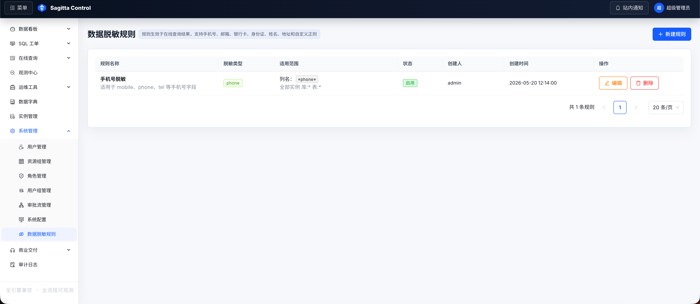

### 1.7 完成端到端验收

正式投产前，建议至少完成以下验证：

1. 管理员、DBA、研发用户、审批人分别登录一次。
2. 研发用户能看到授权范围内的实例和数据库。
3. 研发用户提交一条 SQL 工单，审批人能审批，DBA 能执行，审计日志能记录。
4. 研发用户提交查询权限申请，审批通过后能执行查询。
5. 在线查询命中敏感字段时能按规则脱敏。
6. 观测中心能看到实例健康、采集状态或诊断提示。
7. 数据字典能展示目标库表结构。
8. 数据归档在测试表上完成一次申请、审批和执行验证。
9. `审计日志` 能按用户、模块、操作类型和时间范围检索关键行为。

## 2. 数据看板

数据看板用于查看平台治理和使用情况，适合管理者、DBA 和实施人员每天巡检。

### 2.1 在线查询概览

入口：`数据看板` -> `在线查询概览`。

用于查看近期查询次数、查询用户数、治理失败次数、命中脱敏次数、查询权限申请和撤销情况。上线初期可以用它判断在线查询是否已经被真实使用，以及是否存在频繁失败或权限申请堆积。

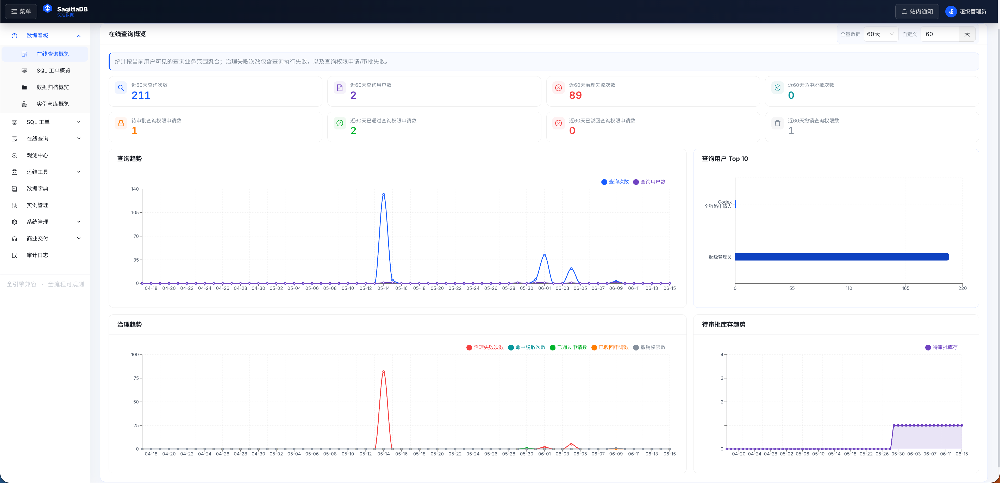

### 2.2 SQL 工单概览

入口：`数据看板` -> `SQL 工单概览`。

用于查看工单提交、审批通过、审批驳回、待审批、执行成功、执行失败、取消和完成情况。DBA 可以通过趋势图和 Top 列表识别高频实例、活跃申请人和异常执行情况。

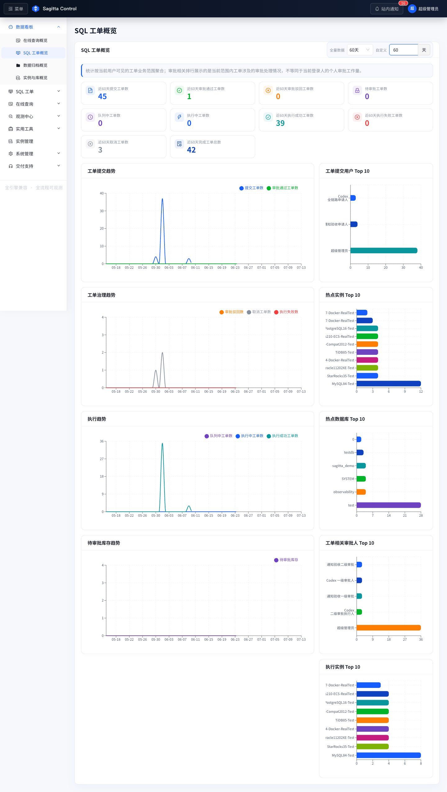

### 2.3 数据归档概览

入口：`数据看板` -> `数据归档概览`。

用于查看归档申请、审批、执行、成功、失败、预计影响行数和高风险归档任务。归档上线前，应通过该页面持续观察任务趋势和风险项。

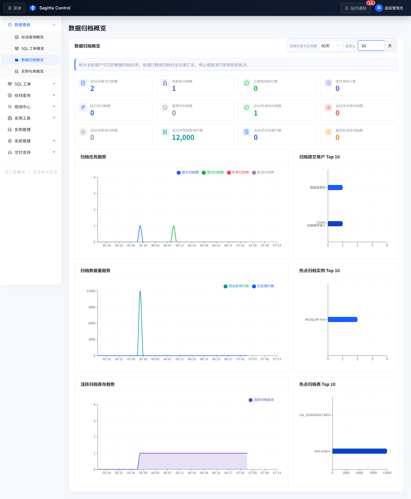

### 2.4 实例与库概览

入口：`数据看板` -> `实例与库概览`。

用于查看当前用户可见实例数、已同步库或 Schema 数、启用状态和数据库类型分布。实施交付时可以用它确认实例接入范围是否完整。

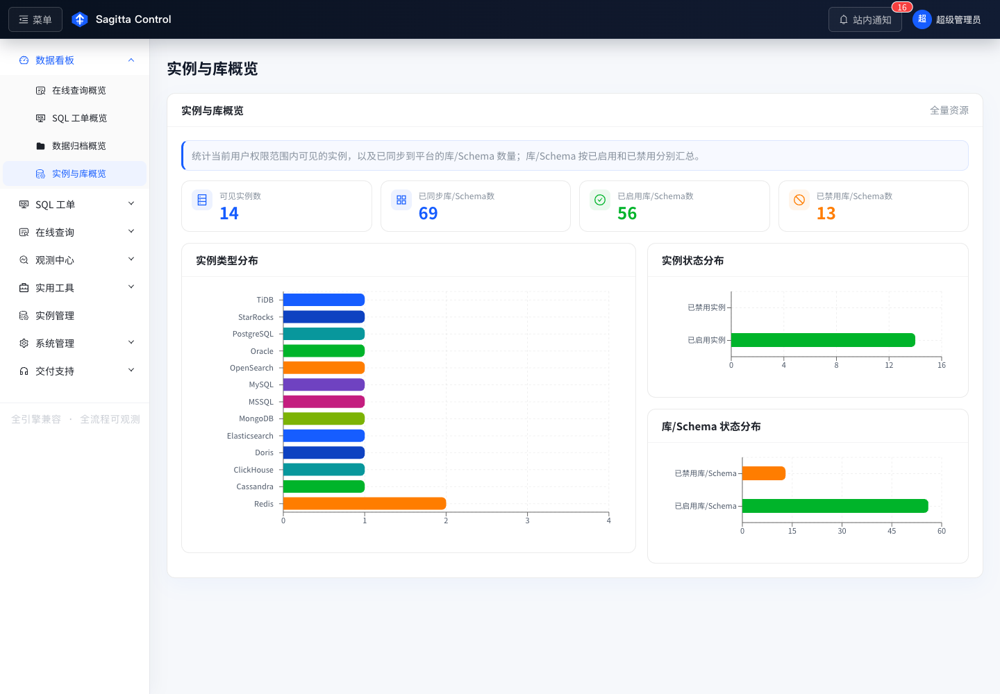

## 3. SQL 工单

SQL 工单用于把数据库变更纳入提交、审批、执行和审计闭环。

### 3.1 工单列表

入口：`SQL 工单` -> `工单列表`。

工单列表包含 `我的工单`、`审批记录`、`执行记录` 和 `工单视图（全量数据）`。不同角色看到的数据范围不同：

- 申请人：查看自己提交的工单和执行结果。
- 审批人：查看待自己处理或已处理的审批记录。
- DBA 或执行人：查看待执行、执行中和已执行的工单。
- 管理员：从全量视图查看所有工单和审批链路。

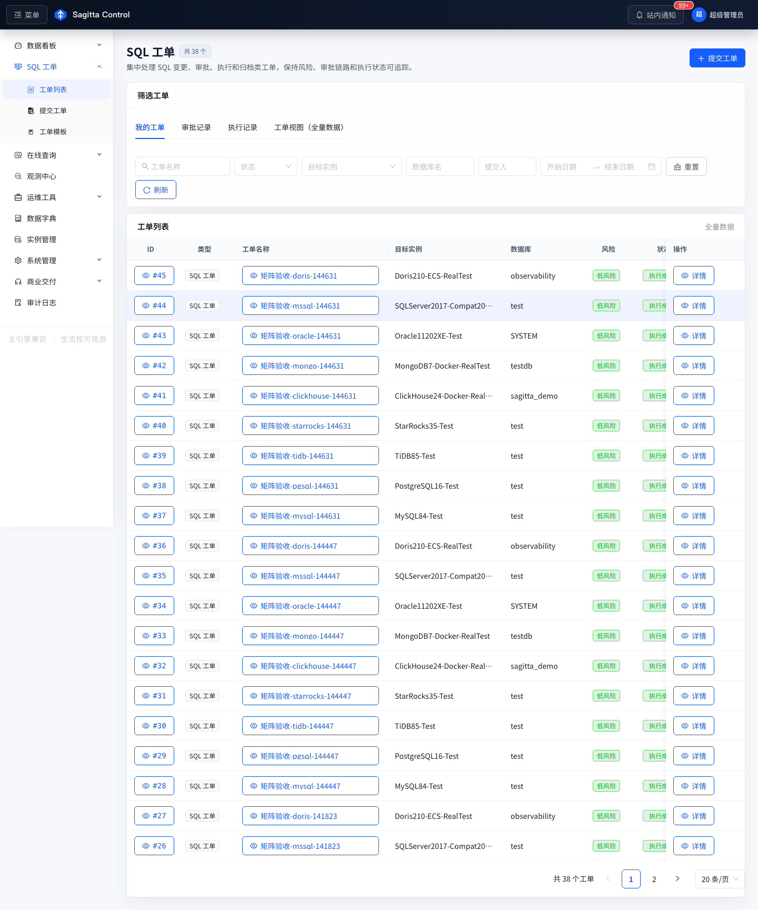

### 3.2 提交 SQL 工单

入口：`SQL 工单` -> `提交工单`。

提交前需要填写工单名称、目标实例、数据库、审批流和 SQL 内容。系统会根据用户组、资源组和实例权限自动解析可选资源，并在提交前执行 SQL 预检查。

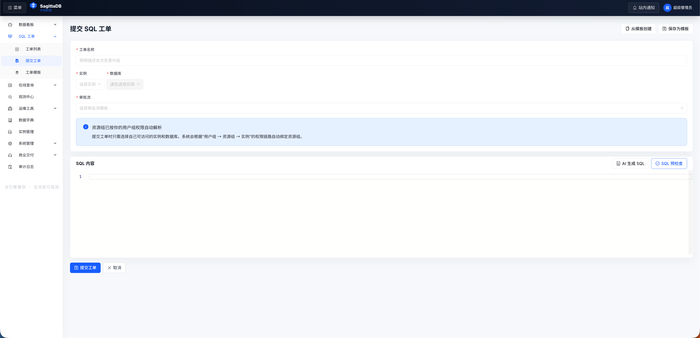

建议：

- 工单名称写清业务背景和变更目标。
- 高风险 SQL 必须附带回滚方案、影响范围和验证步骤。
- 执行 DDL、批量 DML 或归档类 SQL 前，先在测试环境验证。
- 生产变更建议选择维护窗口，并在执行后检查业务指标和审计日志。

### 3.3 工单模板

入口：`SQL 工单` -> `工单模板`。

工单模板用于沉淀常见 SQL 场景，例如新增索引、字段变更、数据修复、巡检查询、只读分析和通用工单。用户可以直接使用模板、预览 SQL 或复制模板内容。

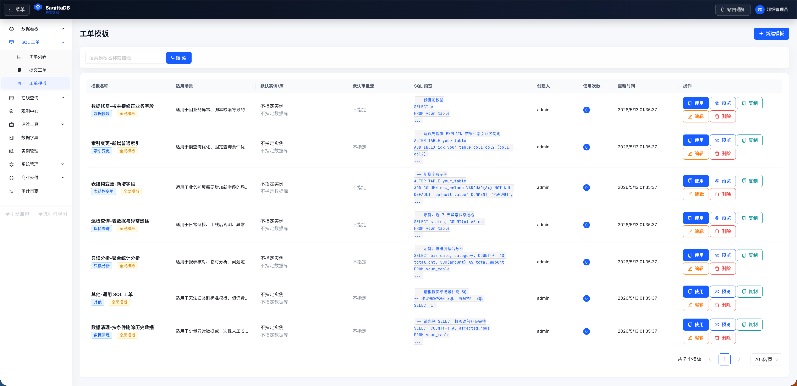

## 4. 在线查询

在线查询用于让研发、DBA 和数据人员在授权范围内自助查询数据，同时保留查询审计、脱敏和历史记录。

### 4.1 执行查询

入口：`在线查询` -> `执行查询`。

选择实例和数据库后，在 SQL 编辑器中输入查询语句并执行。左侧表浏览器可以查看当前数据库下的表，底部区域展示 DDL 预览和查询结果。

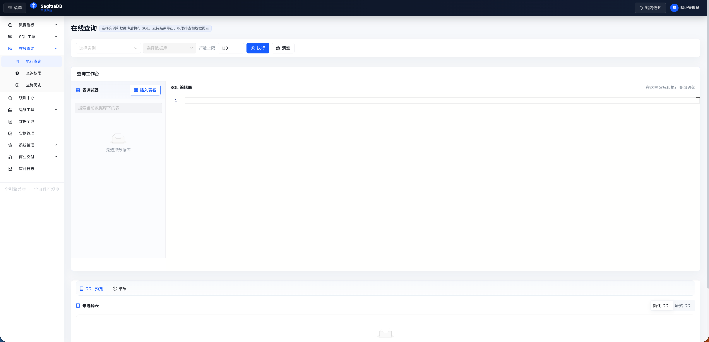

规则说明：

- 普通用户只能查询已授权的实例、数据库或表。
- 系统会限制默认行数和最大返回行数。
- 命中脱敏规则的字段会按规则展示。
- 查询历史会记录执行人、SQL 摘要、结果、耗时、IP 和时间。

### 4.2 查询权限

入口：`在线查询` -> `查询权限`。

当用户没有查询范围，或需要临时查询某个库表时，可以提交查询权限申请。申请时应写清目标实例、数据库、表、行数限制、有效期和申请理由。

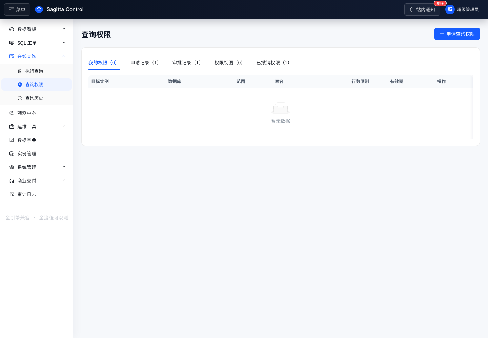

审批人需要重点确认：

- 申请范围是否符合最小权限原则。
- 有效期是否合理。
- 是否涉及生产敏感数据。
- 是否需要补充数据脱敏规则或只读账号限制。

### 4.3 查询历史

入口：`在线查询` -> `查询历史`。

查询历史用于审计 SQL 使用轨迹，可按时间、操作人、实例、数据库、操作类型、脱敏状态和 SQL 关键字筛选。常见用途包括问题回溯、频繁查询识别、敏感查询复核和合规留档。

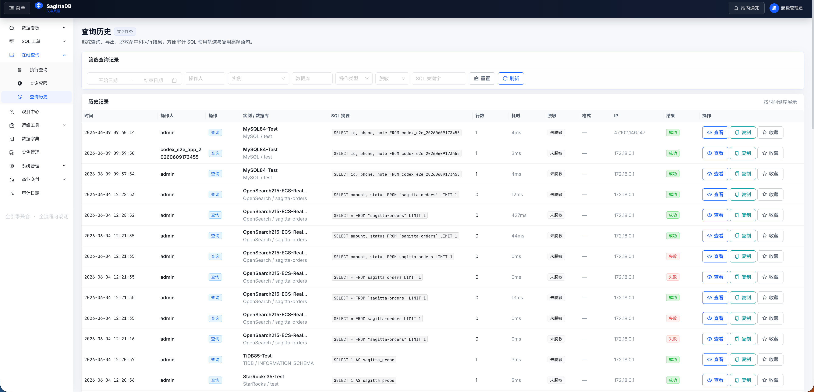

## 5. 观测中心

观测中心用于统一查看数据库实例健康、性能指标、SQL 洞察、会话、容量、复制、等待事件和采集诊断。

### 5.1 舰队总览

入口：`观测中心` -> `舰队总览`。

舰队总览按实例展示健康分、风险原因、采集状态、连接使用率、QPS、慢查询、锁或长事务、TPS、容量、复制延迟和最近采集时间。

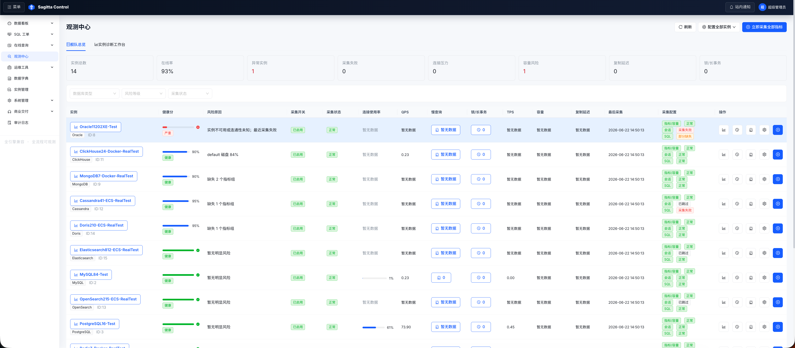

如果实例状态异常，优先检查：

- 数据库网络连通性。
- 采集账号权限。
- 实例状态是否启用。
- 后台采集任务和日志。
- 对应数据库版本是否支持当前指标。

### 5.2 实例诊断工作台

入口：`观测中心` -> `实例诊断工作台`。

选择实例后，可以查看性能、库容量、表容量、会话洞察、SQL 洞察、复制、等待事件、容量增长、告警和采集诊断等页签。

SQL 洞察用于分析 Top SQL、SQL 样本、SQL 指纹、聚合指标和异常样本，适合定位慢 SQL、突增查询和高耗时语句。

诊断工作台与舰队总览共用 `观测中心` 入口，进入实例后按页签切换查看性能、SQL 洞察和采集诊断。

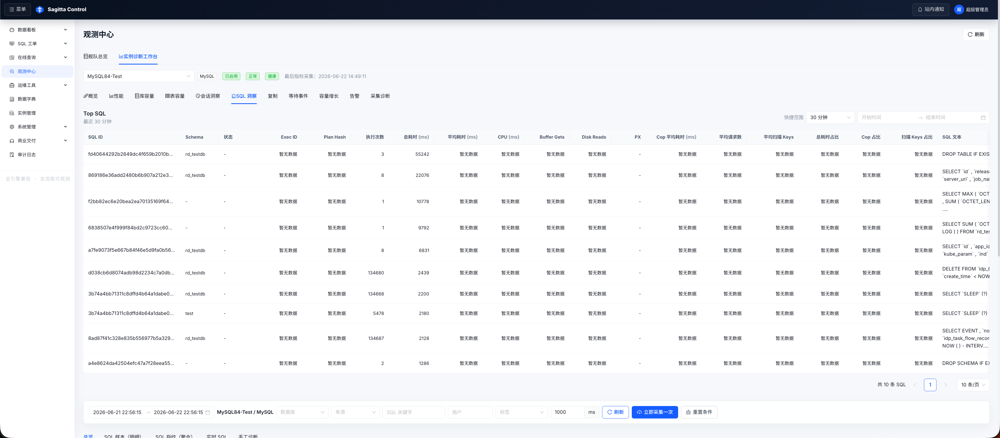

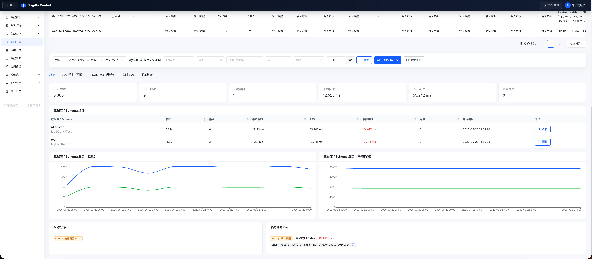

## 6. 数据归档

入口：`运维工具` -> `数据归档`。

数据归档用于标准化历史数据清理、归档或迁移流程。用户填写源实例、数据库、表、归档条件、模式、批次大小、批次间隔、审批流和申请原因后，可以先估算影响，再提交审批。

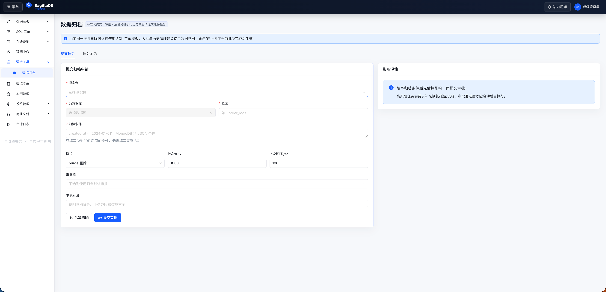

投产建议：

- 先在测试库验证归档条件。
- 生产执行前确认备份、恢复方案和维护窗口。
- 高风险任务必须附带业务影响说明。
- 执行后检查任务记录、目标数据、业务指标和审计日志。

## 7. 数据字典

入口：`数据字典`。

数据字典用于查看实例、数据库、表、字段、默认值、可空性、约束、索引和注释。它能帮助研发和测试人员理解库表结构，减少直接登录数据库执行结构查询。

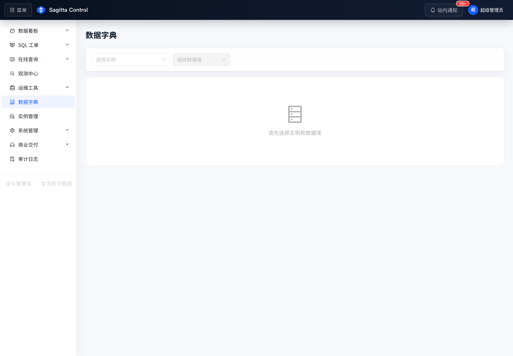

建议管理员定期同步库表结构，并补齐关键字段注释。对于核心业务库，可以将数据字典作为变更评审和测试用例设计的辅助资料。

## 8. 实例管理

入口：`实例管理`。

实例管理用于统一维护数据库连接和启用状态。当前平台可接入 MySQL、PostgreSQL、TiDB、StarRocks、SQL Server、Oracle、MongoDB、Redis、ClickHouse、Doris、Cassandra、Elasticsearch、OpenSearch 等引擎。

日常操作包括：

- 新建实例并填写连接参数。
- 测试连通性。
- 进入数据库列表查看或同步库。
- 编辑实例信息。
- 启用或停用实例。
- 调整实例所属资源组。

实例接入后，普通用户能否看到该实例，取决于用户所在用户组、资源组关联、角色权限和实例启用状态。

## 9. 系统管理

系统管理决定组织、权限、审批和平台行为，是正式投产前最重要的配置区域。

### 9.1 用户管理

入口：`系统管理` -> `用户管理`。

用于创建、导入、导出和维护用户。用户可绑定角色、用户组、直属上级、部门、职位和启用状态。企业身份登录启用后，也需要确保外部账号与平台用户能正确映射。

### 9.2 资源组管理

入口：`系统管理` -> `资源组管理`。

资源组通常对应业务线、项目、系统或环境边界。实例加入资源组后，用户通过用户组和资源组关系获得可见范围。

### 9.3 角色管理

入口：`系统管理` -> `角色管理`。

角色控制功能菜单和操作权限。建议按职责拆分角色，避免把所有权限授予普通研发用户。内置超级管理员角色拥有全局权限，应只分配给少量平台负责人。

### 9.4 用户组管理

入口：`系统管理` -> `用户组管理`。

用户组用于把人员组织到团队、项目或审批范围中。用户组可以关联资源组，形成“哪些团队能访问哪些实例”的权限边界。

### 9.5 审批流管理

入口：`系统管理` -> `审批流管理`。

审批流定义 SQL 工单、查询权限、归档任务等流程的审核链路。节点可以按直属上级、任意审批人或指定用户配置。

### 9.6 系统配置

入口：`系统管理` -> `系统配置`。

系统配置包含基础信息、邮件、钉钉、企业微信、飞书、LDAP、CAS、OIDC、短信和 AI 等配置。修改生产配置前，应记录当前值，并确认是否需要维护窗口。

### 9.7 数据脱敏规则

入口：`系统管理` -> `数据脱敏规则`。

数据脱敏规则按脱敏类型和适用范围生效，常见规则包括手机号、邮箱、银行卡、身份证、姓名、地址和自定义正则。规则启用后，会影响在线查询和导出展示。

## 10. 商业交付

### 10.1 License 授权

入口：`商业交付` -> `License 授权`。

用于查看当前授权状态、剩余天数、版本、来源、功能模块、额度限制，并支持在线激活、联网刷新和续期。管理员只需要确认授权状态正常、客户 ID 和部署指纹符合交付记录即可。

### 10.2 交付与支持

入口：`商业交付` -> `交付与支持`。

用于查看推广就绪度、客户环境用量、实施进度、合规报表、告警中心、支持材料和验收诊断入口。正式投产前，建议在这里生成验收报告或诊断包，并留存到客户内部交付资料中。

## 11. 审计日志

入口：`审计日志`。

审计日志记录登录、工单、查询、实例、系统配置、审批和授权等关键操作。可以按操作人、模块、操作类型、结果和时间范围筛选。

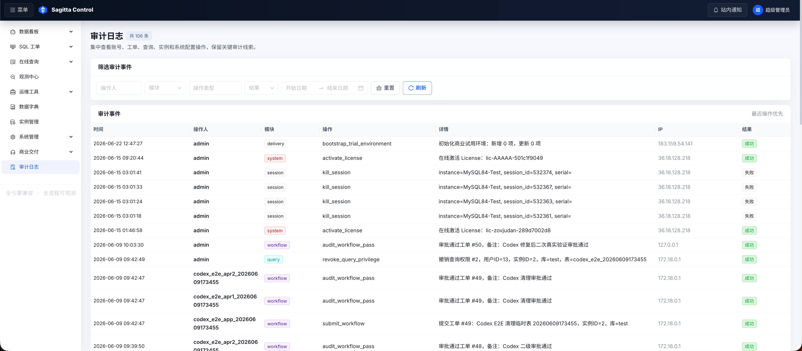

建议：

- 生产环境保留审计日志不少于客户内部合规要求。
- 重大变更后按工单号、操作人和时间范围复核审计记录。
- 共享审计截图或诊断包前先脱敏 IP、客户信息、SQL 片段和账号信息。

## 12. 推荐投产清单

| 阶段 | 检查项 | 完成标准 |
|---|---|---|
| 基础服务 | 前端、后端、PostgreSQL、Redis 健康 | `docker compose ps` 正常，前后端健康接口成功 |
| 授权 | 试用或正式授权可用 | 产品内显示授权状态正常 |
| 平台配置 | 访问地址、审计保留、查询限制、通知渠道 | 系统配置保存成功，通知测试通过 |
| 组织权限 | 用户、角色、用户组、资源组 | 普通用户只看到授权范围内菜单和实例 |
| 实例接入 | 首批数据库实例 | 连通性测试通过，实例加入资源组 |
| 审批流 | SQL 工单、查询权限、归档 | 申请、审批、执行或授权链路可闭环 |
| 查询治理 | 查询权限、行数限制、脱敏规则 | 未授权查询被拦截，敏感字段可脱敏 |
| SQL 工单 | 提交、审批、执行、记录 | 工单全流程通过，失败场景可追踪 |
| 观测诊断 | 实例健康与采集 | 至少能看到实例状态或明确采集诊断原因 |
| 审计 | 查询、工单、配置操作日志 | 关键操作可按条件检索 |
| 交付资料 | 验收报告、诊断包、升级方案 | 客户内部留档完成 |

## 13. 常见问题

| 问题 | 处理建议 |
|---|---|
| 看不到菜单 | 检查角色权限、License 功能范围和账号状态。 |
| 看不到实例或数据库 | 检查资源组、用户组、实例状态、数据库启用状态和查询权限。 |
| 工单无法提交 | 检查目标实例、数据库、审批流、SQL 预检查和用户资源范围。 |
| 工单没人审批 | 检查审批流节点、直属上级、指定审批人和通知渠道。 |
| 在线查询被拒绝 | 检查功能权限、查询授权、SQL 类型、行数限制和实例状态。 |
| 查询结果没有脱敏 | 检查脱敏规则是否启用，列名、库表范围和规则类型是否匹配。 |
| 数据字典为空 | 检查实例连通性、账号权限、库是否启用以及结构同步任务。 |
| 监控数据为空 | 检查采集开关、数据库账号权限、实例连通性和后台采集任务。 |
| 归档无法执行 | 检查审批状态、归档条件、备份方案、执行账号权限和任务日志。 |
| 审计记录不完整 | 检查审计保留天数、筛选条件、操作模块和日志写入状态。 |
| 授权激活失败 | 检查客户 ID、部署指纹、授权中心连通性、服务器时间和激活码。 |

共享截图、日志或诊断包前，请确认没有暴露服务器 IP、客户数据、数据库密码、License 文件、激活码、`.env`、Token 或未脱敏 SQL。
