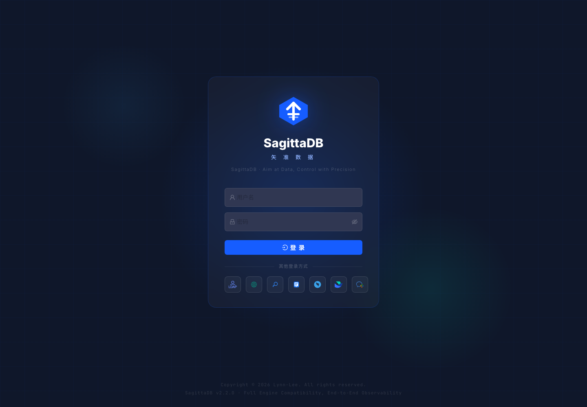

# SagittaDB Enterprise 产品使用手册

本文面向 SagittaDB Enterprise 的试用客户、平台管理员、DBA、研发用户、审批人和审计人员，按真实菜单顺序说明主要页面、典型用途和使用注意事项。

本手册截图来自 SagittaDB 云 ECS 测试环境，由 Playwright 登录测试环境后截取页面视口生成，不包含浏览器地址栏、测试环境 IP 或登录密码。`License 授权 / 授权管理` 页面包含客户 ID、部署指纹和授权状态等敏感信息，按要求不放入公开截图。

## 1. 登录

打开客户侧访问地址后进入登录页。系统支持账号密码登录，也可以按客户配置启用 LDAP、CAS、OIDC、短信验证码、钉钉、飞书或企业微信入口。

登录后，右上角显示当前用户和站内通知入口。不同角色看到的菜单和数据会根据权限、用户组、资源组、查询授权和 License 功能范围裁剪。

## 2. 数据看板

数据看板提供四个概览页，适合管理者、DBA 和实施人员快速了解平台使用状态。

### 2.1 在线查询概览

用于查看近期查询次数、查询用户、治理失败、命中脱敏、查询权限申请等指标。研发团队试用时，可以用它判断在线查询链路是否已经产生真实使用记录。

### 2.2 SQL 工单概览

用于查看工单提交、审批、执行、失败和高风险分布。DBA 可以通过这个页面快速定位待处理工单和执行异常。

### 2.3 数据归档概览

用于查看归档申请、审批、执行、失败、数据量和任务趋势。上线归档流程前，应先在测试环境确认归档条件和回滚方案。

### 2.4 实例与库概览

用于查看实例数量、数据库数量、引擎分布和实例状态。实施交付时可以先从这里确认接入范围是否完整。

## 3. SQL 工单

SQL 工单用于把数据库变更纳入提交、审批、执行和审计闭环。

### 3.1 工单列表

入口：`SQL 工单` -> `工单列表`。

工单列表用于查看我的工单、审批记录和执行记录。可以按状态、实例、数据库、提交人和时间筛选，适合研发跟踪提交进度，也适合 DBA 排查执行失败。

### 3.2 提交工单

入口：`SQL 工单` -> `提交工单`。

提交工单时需要选择目标实例和数据库，填写 SQL、变更说明和必要的回滚信息。系统会执行语法、风险和规则检查，高风险 SQL 应先在测试环境验证。

### 3.3 工单模板

入口：`SQL 工单` -> `工单模板`。

工单模板用于沉淀常见变更样例，例如新增索引、字段调整、数据修复和权限变更。模板能减少重复录入，也能帮助团队统一 SQL 变更规范。

## 4. 在线查询

在线查询用于让研发和 DBA 在授权范围内自助查询数据，并自动保留查询审计。

### 4.1 执行查询

入口：`在线查询` -> `执行查询`。

用户选择实例和数据库后，在编辑器中输入查询 SQL。系统会检查 SQL 类型、语法、资源范围和查询授权。命中脱敏规则的字段会按规则显示。

### 4.2 查询权限

入口：`在线查询` -> `查询权限`。

当用户没有查询范围时，可以提交查询权限申请。审批人应关注申请理由、实例和库表范围、有效期以及是否涉及生产敏感数据。

### 4.3 查询历史

入口：`在线查询` -> `查询历史`。

查询历史记录执行人、实例、数据库、SQL 摘要、执行状态、耗时和时间，可用于问题回溯和合规审计。

## 5. 观测中心

入口：`观测中心`。

观测中心用于查看数据库实例的采集状态、健康指标、慢 SQL、会话和诊断信息。不同数据库的高级诊断能力取决于账号权限、数据库版本和驱动支持。

如果页面显示采集失败，优先检查数据库账号权限、网络连通性、实例状态和后台采集任务日志。

## 6. 运维工具

### 6.1 数据归档

入口：`运维工具` -> `数据归档`。

数据归档用于将历史数据按策略迁移、下沉或归档。生产归档前必须确认条件、备份、测试验证和业务窗口。

## 7. 数据字典

入口：`数据字典`。

数据字典用于查看实例、数据库、表、字段、索引和结构说明。它能减少研发直接登录数据库查看结构的需求，也方便测试和数据人员理解业务数据。

建议管理员定期补齐关键表和字段备注。

## 8. 实例管理

入口：`实例管理`。

实例管理用于维护数据库连接、引擎类型、默认数据库、资源组归属和启停状态。生产环境建议为 SagittaDB 配置只读诊断账号和受控变更账号，避免直接使用数据库超级管理员账号。

新增实例后，应测试连接并将实例加入资源组，否则普通用户可能无法在 SQL 工单和在线查询中看到该实例。

## 9. 系统管理

系统管理决定组织、权限、审批和平台配置，是管理员初始化 SagittaDB 的核心区域。

### 9.1 用户管理

入口：`系统管理` -> `用户管理`。

用于创建用户、维护账号状态、绑定角色、设置上级、查看用户组和资源组关系。企业身份登录启用后，也需要确保外部账号能映射到正确用户。

### 9.2 资源组管理

入口：`系统管理` -> `资源组管理`。

资源组通常对应业务线、项目、环境或系统边界。实例加入资源组后，用户通过用户组和资源组关系获得可见范围。

### 9.3 角色管理

入口：`系统管理` -> `角色管理`。

角色决定用户可以执行哪些功能操作。建议按平台管理员、DBA、研发用户、审批人、审计人员拆分角色，不要把所有权限授予普通用户。

### 9.4 用户组管理

入口：`系统管理` -> `用户组管理`。

用户组用于把人员组织到团队、项目或业务范围中。配合资源组后，可以控制“哪个团队能看到哪些数据库实例”。

### 9.5 审批流管理

入口：`系统管理` -> `审批流管理`。

审批流用于配置 SQL 工单、查询权限和归档等流程的审核链路。推荐按客户组织结构设置研发负责人、DBA、安全或业务负责人等节点。

### 9.6 系统配置

入口：`系统管理` -> `系统配置`。

系统配置用于维护平台品牌、认证入口、通知渠道、安全策略和运行参数。修改生产配置前，应先记录当前值并确认是否需要维护窗口。

### 9.7 数据脱敏规则

入口：`系统管理` -> `数据脱敏规则`。

数据脱敏规则用于保护手机号、邮箱、身份证号、地址、Token、密钥等敏感字段。规则会影响在线查询和导出展示。

## 10. 商业交付

入口：`商业交付`。

商业交付包含 `License 授权` 和 `交付与支持`。其中 `License 授权 / 授权管理` 页面包含客户 ID、部署指纹、激活状态和授权材料，不在公开截图集中展示。

`交付与支持` 页面用于查看推广就绪度、实施交付、合规报表、告警中心、支持文档和引擎支持矩阵。公开截图选取不包含授权信息的告警中心区域。

客户正式推广前，管理员仍应在产品内完成以下事项：

- 确认试用或正式授权状态。
- 确认客户 ID 和部署指纹。
- 生成交付验收报告。
- 导出脱敏诊断包。
- 检查推广就绪度和阻塞项。

## 11. 审计日志

入口：`审计日志`。

审计日志记录账号、工单、查询、实例和系统配置操作。公开截图使用安全筛选条件展示空结果状态，避免暴露真实审计行、客户 ID、来源 IP 或 License 操作记录。

客户内部使用时，可以按操作人、模块、操作类型、时间范围和结果筛选审计记录，并按内部合规要求定期导出归档。

## 12. 初始化建议

首次部署后建议按以下顺序初始化：

1. 确认 License 或试用状态。
2. 配置系统品牌、认证入口和通知渠道。
3. 创建角色、用户组和资源组。
4. 接入数据库实例并注册数据库或 Schema。
5. 配置审批流。
6. 创建 SQL 工单和查询权限申请做端到端验证。
7. 检查数据看板、审计日志和交付验收报告。

## 13. 常见问题

| 问题 | 处理建议 |
|---|---|
| 看不到菜单 | 检查角色权限、License 功能范围和账号状态。 |
| 看不到实例或数据库 | 检查资源组、用户组、实例状态和数据库启用状态。 |
| 在线查询被拒绝 | 检查功能权限、查询授权、SQL 类型和实例状态。 |
| 工单无法提交 | 检查目标实例、数据库、审批流程和 SQL 风险规则。 |
| 监控数据为空 | 检查数据库账号权限、采集任务和实例连通性。 |
| 授权激活失败 | 检查客户 ID、部署指纹、授权中心连通性和服务器时间。 |

共享截图或诊断包前，请先确认没有暴露服务器 IP、客户数据、数据库密码、License 文件、激活码或 `.env` 敏感值。
